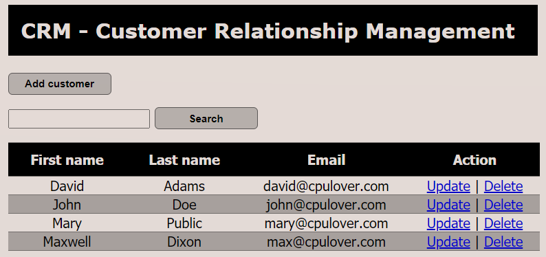
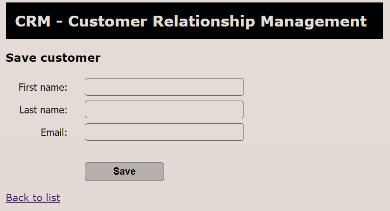

# Customer Relationship Management Web Application
|[Features](#features)|[Languagues & Technologies](#tools)|[Enviroment setup](#setup-enviroment)|[Main process](#main)|[Additional process](#additional)|[JSP](#jsp)|[Notes](#notes)|
|---|---|---|---|---|---|---|

<p align="center">       </p>

## About
A simple web application to manage customer relationships, using Spring MVC and Hibernate, configured by XML
### Features
- View customers
- Add new customer
- Update customer
- Delete customer
- AOP Logging support

<a name="tools">
   
### Languagues & Technologies
- Java
- XML
- MySQL
- Spring MVC
- Spring AOP
- Hibernate
- JSTL
- JSP
- CSS/JavaScript

## Development Process

### Setup enviroment
1. Create new Dynamic Web Project in Eclipse
2. Create MySQL database in Workbench 
[[create-database.sql]()]
3. Import jars to library: WEB-INF/lib
   - MySQL connector 
[[URL]()]
   - JSTL API (for JSP) 
[[URL]()]
   - Spring framework 
[[URL](https://repo.spring.io/release/org/springframework/spring/)]
   - Hibernate (required folder) and c3p0 (optional folder) 
[[URL]()]
   - AspectJ (for AOP) 
[[URL](https://mvnrepository.com/artifact/org.aspectj/aspectjweaver)].

4. For Java 9+, include following jars in WEB-INF/lib
   - javax.activation-1.2.0.jar
   - jaxb-api-2.3.0.jar
   - jaxb-core-2.3.0.jar
   - jaxb-impl-2.3.0.jar
5. Test database connection (Project facets/runtimes/Tomcat): create a servlet 
[[TestDatabaseServlet](https://github.com/cpulover-projects/crm-web-app/blob/master/src/com/cpulover/testdatabase/TestDabaseServlet.java)]
6. Include configuaration xml files (spring mvc and web) in WEB-INF.
7. Configure Spring + Hibernate in xml files
[[spring-mvc-crud-demo-servlet.xml](https://github.com/cpulover-projects/crm-web-app/blob/master/WebContent/WEB-INF/spring-mvc-crud-demo-servlet.xml)]
    - Define XML namespaces and schema locations
    - Define database dataSource / connection pool
    - Setup Hibernate session factory
    - Setup Hibernate transaction manager
    - Enable configuration of transctional annotation
    - Add support for reading web resources: css, images, js, etc.
    - Enable AspectJ Auto Proxy
8. Test Spring controller: create a Controller class with a method return to a new JSP file in 'view' folder.

### Main
1. Create Customer class and map to database table using Hibernate.
2. Create CustomerDAO interface.
3. Create CustomerDAOImpl class with *__@Repository__*
   - Inject the session factory with *__@Autowired__*
   - Implement methods
     - Get the current Hibernate session
     - Create a query [org.hibernate.query.Query]
     - Execute query and get result list
     - Return result
4. Create Service interface
5. Create Service implementation with *__@Service__*
   - Inject DAO with *__@Autowired__*.
   - Implement methods with *__@Transactional__*.
   - Delegate calls to DAO.
6. Create/Update CustomerController
   - Inject CustomerService using *__@Autowired__*
   - Create a request method with *__@RequestMapping__*
   - Get result from Service from DAO or create model attribute to bind form data 
[[CustomerController](https://github.com/cpulover-projects/crm-web-app/tree/master/src/com/cpulover/springdemo/controller)]
     - Add result/attribute to the model
     - Return JSP page
7. Create/Update JSP pages
   - Add support for JSTL Core tags: ```<%@ taglib uri="http://java.sun.com/jsp/jstl/core" prefix="c" %>```
8. Create Aspect class with *__@Aspect__* and *__@Component__* 
[[LoggingAspect](https://github.com/cpulover-projects/crm-web-app/blob/master/src/com/cpulover/springdemo/aspect/LoggingAspect.java)] 
[[Reference](https://github.com/cpulover-practice/spring-aop)]
   - Add logger 
   - Setup pointcut declarations
   - Add advices

### Additional
1. Prettify JSP page with CSS
   - Place CSS in a 'resources' folder in WebContent.
   - Configure Spring to serve up 'resources' folder.
   - Reference CSS in the JSP.
2. Configure welcome files in Spring XML to redirect from home page
   - Create a JSP inside WebContent, match with name of welcome file in XML 
[[index.jsp](https://github.com/cpulover-projects/crm-web-app/blob/master/WebContent/index.jsp)]
   - Redirect to a desired address: ```<% response.sendRedirect("address"); %>```
3. Refactor request method in the Controller using *__@GetMapping__*, *__@PostMapping__*

### JSP
- Support for Spring MVC Form Tags: ```<%@ taglib prefix="form" uri="http://www.springframework.org/tags/form"%>```
- ```${pageContext.request.contextPath}``` returns proper app name in JSP. 

### Notes
- Package for scanning must match in Spring configuration xml file.
- 'view' folder containning JSP files must match in Spring configuration xml file
- Run project: choose project root -> run as -> run on server.
- Use SessionFactory.saveOrUpdate(): combine save() and update()
[[CustomerDAOImpl](https://github.com/cpulover-projects/crm-web-app/blob/master/src/com/cpulover/springdemo/dao/CustomerDAOImpl.java)]
- *__@RequestMapping__* (hanlde all methods), *__@GetMapping__*, *__@PostMapping__*
- ```@RequestMapping(path="...", method=RequestMethod.GET)``` <=> ```@GetMapping(path="...")```
- Use "redirect:mapped_method" to redirect to a given method in the Controller instead of JSP page
[[CustomerController](https://github.com/cpulover-projects/crm-web-app/blob/master/src/com/cpulover/springdemo/controller/CustomerController.java)]
- Use *__@Transactional__* [org.springframework] to start and close transaction for a method 
[[CustomerDAO](https://github.com/cpulover-projects/crm-web-app/blob/master/src/com/cpulover/springdemo/dao/CustomerDAO.java)]
- Use *__@Repository__* with DAO implementation to handle exception translation.
- Use *__@Service__* for Service implementation.
- **Service Layer design pattern**
  - Define *__@Transactional__* at Service layer instead of DAO.
  - Inject Service instead of DAO in the Controller.
  - Controller <-> Service layer <-> DAO.

---
[**Go to top**](#customer-relationship-management-web-application)


